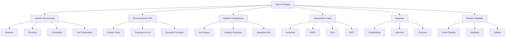

# Análisis del Sistema Notefy IA - Estructura y Relaciones

## 1. Estructura de Módulos Principales

### 1.1 Módulos de Control
- **master/**
  - `main.py`: Punto de entrada principal, gestión de menús de alto nivel
  - `system_orchestrator.py`: Orquestador central del sistema

### 1.2 Módulos Core
- **core/**
  - `import_consolidator.py`: Consolidación de datos de pacientes
  - `data_processor.py`: Procesamiento de documentos

### 1.3 Utilidades
- **utils/**
  - `menu_manager.py`: Gestión centralizada de menús
  - `clinic_manager.py`: Gestión de clínicas
  - `template_manager.py`: Gestión de plantillas
  - `data_formats.py`: Manejo de formatos de datos
  - **template_management/**
    - `system_integrator.py`: Integración de sistemas
    - `pdf_builder.py`: Construcción de PDFs
    - `field_analyzer.py`: Análisis de campos
    - `validators.py`: Validación de datos
    - `version_control.py`: Control de versiones

### 1.4 Módulos de Procesamiento
- **pdf_extractor/**
  - `pdf_extractor.py`: Extracción de texto de PDFs

### 1.5 Módulos de Exportación
- **pacientes/**
  - `pacientes.py`: Exportación de datos de pacientes
- **FARC/**
  - `fars.py`: Exportación de evaluaciones FARC
- **BIO/**
  - `bios.py`: Exportación de historias BIO
- **MTP/**
  - `mtp.py`: Exportación de planes MTP

## 2. Jerarquía de Menús



## 3. Relaciones y Dependencias

### 3.1 Dependencias Directas
- `MenuManager` ↔ `ClinicManager`
- `ClinicManager` → `TemplateManager`
- `ImportConsolidator` → `DataFormatHandler`
- `PDFExtractor` → `AIExtractor`

### 3.2 Módulos sin Integración Completa
1. `test_automation.py`: No está integrado en el flujo principal
2. `template_optimizer.py`: Falta integración con el menú de plantillas
3. `validation_reporter.py`: No está conectado al sistema de reportes

## 4. Análisis de Integraciones Pendientes

### 4.1 Módulos a Integrar
| Módulo | Estado | Ubicación Sugerida en Menú |
|--------|---------|---------------------------|
| `test_automation.py` | Sin integrar | Menú de Desarrollo |
| `template_optimizer.py` | Parcial | Gestión de Plantillas |
| `validation_reporter.py` | Sin integrar | Reportes y Análisis |

### 4.2 Funcionalidades sin Menú
1. Optimización de plantillas
2. Automatización de pruebas
3. Reportes de validación detallados

## 5. Recomendaciones de Integración

### 5.1 Menú Principal
Agregar nueva opción:
```python
print("5. Herramientas de Desarrollo")
print("   • Ejecutar pruebas")
print("   • Optimizar plantillas")
print("   • Reportes de validación")
```

### 5.2 Integración de Módulos
1. Crear nuevo submódulo de desarrollo
2. Integrar herramientas de prueba
3. Conectar optimizador de plantillas
4. Implementar sistema de reportes detallados

## 6. Estructura de Datos

### 6.1 Clínica
```
Data/
└── [Clínica]/
    ├── clinic_config.json
    ├── [Facilitador]/
    │   └── grupos/
    │       ├── manana/
    │       └── tarde/
    └── import_data/
```

### 6.2 Plantillas
```
templates/
├── Campos Codigos/
└── Campos Master Global/
```

## 7. Conclusiones y Recomendaciones

### 7.1 Mejoras Prioritarias
1. Integrar módulos desconectados
2. Unificar gestión de menús
3. Implementar sistema de logging consistente
4. Completar documentación de interfaces

### 7.2 Pasos Siguientes
1. Crear menú de herramientas de desarrollo
2. Integrar módulos pendientes
3. Implementar pruebas automatizadas
4. Mejorar sistema de reportes

### 7.3 Notas Técnicas
- Mantener compatibilidad con la estructura actual
- Documentar nuevas integraciones
- Seguir patrones de diseño existentes
- Mantener separación de responsabilidades