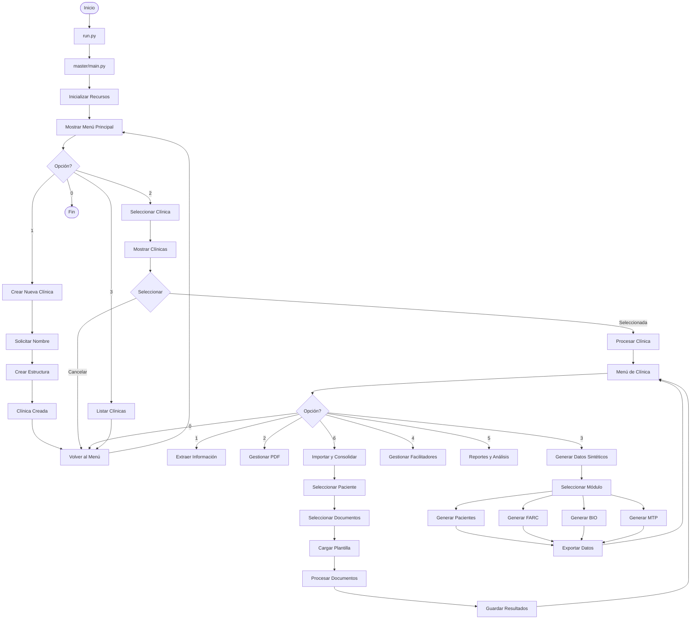
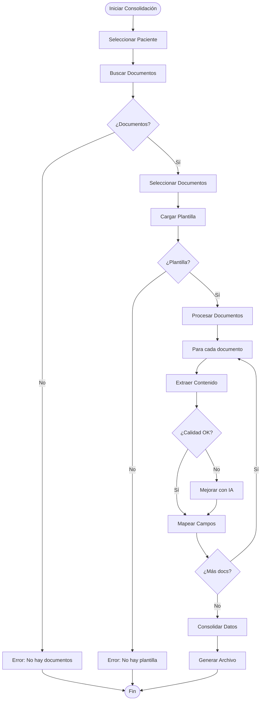
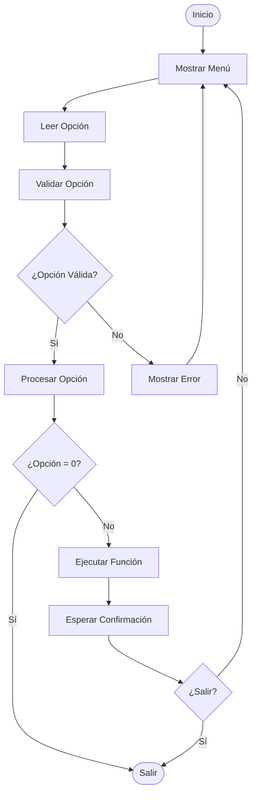

# Diagrama de Flujo del Sistema

## Flujo Principal de Ejecución

```mermaid
flowchart TD
    %% Estados principales
    Start([Inicio]) --> RunPy[run.py]
    RunPy --> MainPy[master/main.py]
    MainPy --> InitResources[Inicializar Recursos]
    InitResources --> ShowMenu[Mostrar Menú Principal]
    
    %% Flujo de menú principal
    ShowMenu --> MenuOption{Opción?}
    MenuOption -->|1| CreateClinic[Crear Nueva Clínica]
    MenuOption -->|2| SelectClinic[Seleccionar Clínica]
    MenuOption -->|3| ListClinics[Listar Clínicas]
    MenuOption -->|0| Exit([Fin])
    
    %% Flujo de creación de clínica
    CreateClinic --> GetClinicName[Solicitar Nombre]
    GetClinicName --> SetupClinic[Crear Estructura]
    SetupClinic --> ClinicCreated[Clínica Creada]
    ClinicCreated --> BackToMenu[Volver al Menú]
    
    %% Flujo de selección de clínica
    SelectClinic --> ClinicsList[Mostrar Clínicas]
    ClinicsList --> ClinicSelection{Seleccionar}
    ClinicSelection -->|Seleccionada| ProcessClinic[Procesar Clínica]
    ClinicSelection -->|Cancelar| BackToMenu
    
    %% Procesamiento de clínica
    ProcessClinic --> ClinicMenu[Menú de Clínica]
    ClinicMenu --> ClinicOption{Opción?}
    
    %% Opciones de menú de clínica
    ClinicOption -->|1| ExtractInfo[Extraer Información]
    ClinicOption -->|2| ProcessPDF[Gestionar PDF]
    ClinicOption -->|3| GenSynthetic[Generar Datos Sintéticos]
    ClinicOption -->|4| ManageFacilitators[Gestionar Facilitadores]
    ClinicOption -->|5| Reports[Reportes y Análisis]
    ClinicOption -->|6| ImportConsolidate[Importar y Consolidar]
    ClinicOption -->|0| BackToMenu
    
    %% Consolidación de datos
    ImportConsolidate --> SelectPatient[Seleccionar Paciente]
    SelectPatient --> SelectDocs[Seleccionar Documentos]
    SelectDocs --> LoadTemplate[Cargar Plantilla]
    LoadTemplate --> ProcessDocs[Procesar Documentos]
    ProcessDocs --> SaveResults[Guardar Resultados]
    SaveResults --> ClinicMenu
    
    %% Generación de datos sintéticos
    GenSynthetic --> SelectModule[Seleccionar Módulo]
    SelectModule --> GenPatients[Generar Pacientes]
    SelectModule --> GenFARC[Generar FARC]
    SelectModule --> GenBIO[Generar BIO]
    SelectModule --> GenMTP[Generar MTP]
    GenPatients --> ExportData[Exportar Datos]
    GenFARC --> ExportData
    GenBIO --> ExportData
    GenMTP --> ExportData
    ExportData --> ClinicMenu
    
    %% Todos vuelven al menú
    ListClinics --> BackToMenu
    BackToMenu --> ShowMenu

    %% Estilo para destacar estados importantes
    class ShowMenu,MenuOption,ClinicMenu,ClinicOption fill:#f9f,stroke:#333,stroke-width:2px
    class ImportConsolidate,GenSynthetic,ProcessPDF,ExtractInfo fill:#bbf,stroke:#333,stroke-width:1px
    class Start,Exit fill:#bfb,stroke:#333,stroke-width:2px
```

## Flujo de Consolidación de Datos

```mermaid
flowchart TD
    %% Flujo de consolidación de datos
    Start([Iniciar Consolidación]) --> SelectPatient[Seleccionar Paciente]
    SelectPatient --> FindDocs[Buscar Documentos]
    FindDocs --> DocsFound{¿Documentos?}
    
    DocsFound -->|Sí| SelectDocs[Seleccionar Documentos]
    DocsFound -->|No| Error1[Error: No hay documentos]
    Error1 --> End([Fin])
    
    SelectDocs --> LoadTemplate[Cargar Plantilla]
    LoadTemplate --> TemplateOk{¿Plantilla?}
    
    TemplateOk -->|Sí| ProcessDocs[Procesar Documentos]
    TemplateOk -->|No| Error2[Error: No hay plantilla]
    Error2 --> End
    
    ProcessDocs --> ForEachDoc[Para cada documento]
    ForEachDoc --> ExtractContent[Extraer Contenido]
    ExtractContent --> CheckQuality{¿Calidad OK?}
    
    CheckQuality -->|Sí| MapFields[Mapear Campos]
    CheckQuality -->|No| ImproveQuality[Mejorar con IA]
    ImproveQuality --> MapFields
    
    MapFields --> NextDoc{¿Más docs?}
    NextDoc -->|Sí| ForEachDoc
    NextDoc -->|No| ConsolidateData[Consolidar Datos]
    
    ConsolidateData --> GenerateFile[Generar Archivo]
    GenerateFile --> End
```

## Flujo de Interacción con el Menú

```mermaid
flowchart TD
    %% Flujo de interacción con el menú
    Start([Inicio]) --> ShowMenu[Mostrar Menú]
    ShowMenu --> GetOption[Leer Opción]
    GetOption --> ValidateOption[Validar Opción]
    ValidateOption --> IsValid{¿Opción Válida?}
    
    IsValid -->|Sí| Process[Procesar Opción]
    IsValid -->|No| ShowError[Mostrar Error]
    ShowError --> ShowMenu
    
    Process --> Option0{¿Opción = 0?}
    Option0 -->|Sí| Exit([Salir])
    Option0 -->|No| ExecuteOption[Ejecutar Función]
    
    ExecuteOption --> WaitConfirm[Esperar Confirmación]
    WaitConfirm --> IsExit{¿Salir?}
    IsExit -->|Sí| Exit
    IsExit -->|No| ShowMenu
```
