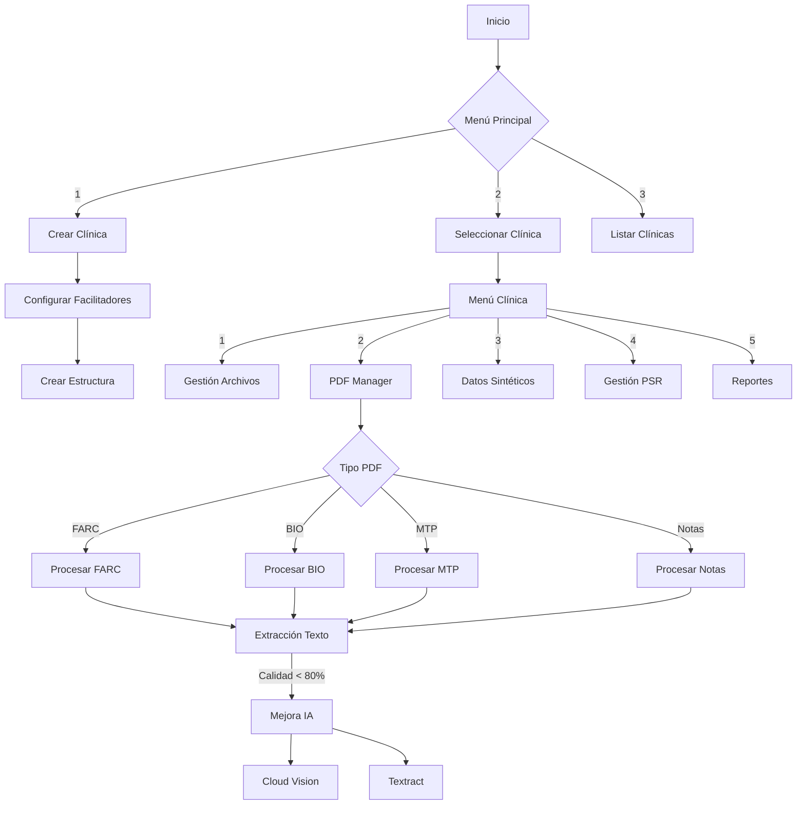
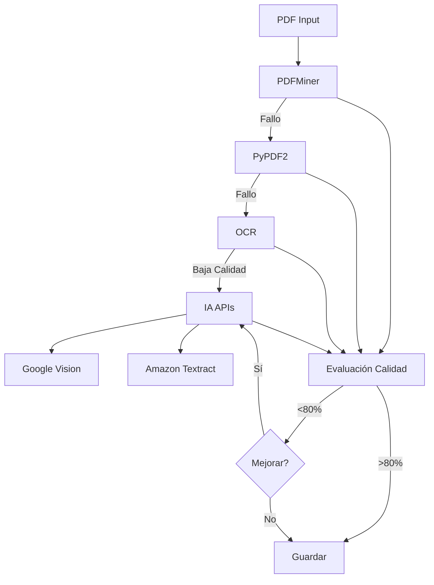
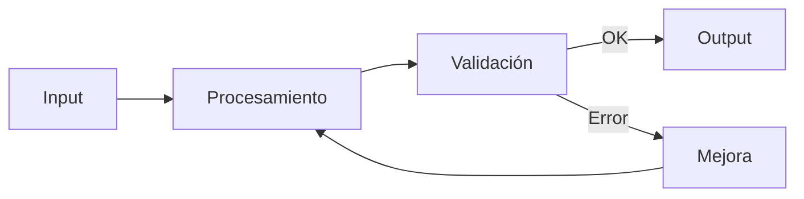

# Diagrama de Flujo Actualizado del Sistema

## Flujo Principal


## Estructura de Procesamiento PDF


## Nuevo Flujo de Datos


## Estructura de Carpetas Actualizada
```
Data/
├── Clínica/
│   ├── Facilitador/
│   │   ├── grupos/
│   │   │   ├── manana/
│   │   │   │   ├── pacientes/
│   │   │   │   │   └── [nombre_paciente]/
│   │   │   │   │       ├── FARC/
│   │   │   │   │       │   ├── input/
│   │   │   │   │       │   └── output/
│   │   │   │   │       ├── BIO/
│   │   │   │   │       ├── MTP/
│   │   │   │   │       ├── notas_progreso/
│   │   │   │   │       ├── Internal_Referral/
│   │   │   │   │       └── Intake/
│   │   │   └── tarde/
│   └── clinic_config.json
```
