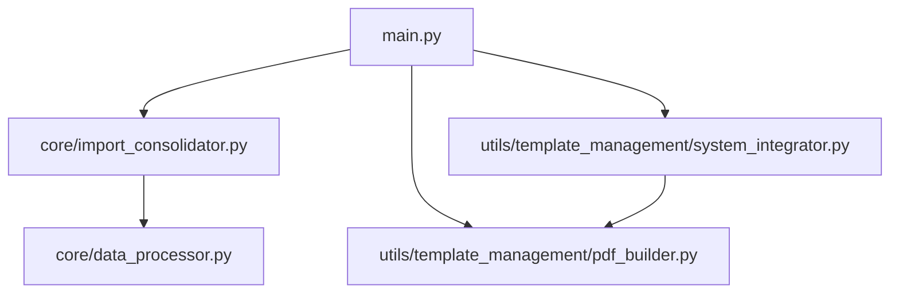

# Análisis Estructural del Proyecto

## Estructura General

## Componentes Principales

### 1. Sistema de Entrada (main.py)
- Gestión de argumentos CLI
- Control de flujo principal
- Manejo de comandos:
  - consolidar
  - procesar
  - status

### 2. Módulos Core
- ImportConsolidator: Consolidación de datos
- DataProcessor: Procesamiento de documentos

### 3. Utilidades
- SystemIntegrator: Integración de sistemas
- PDFBuilder: Construcción de documentos

## Dependencias y Relaciones
| Módulo | Dependencias | Riesgo de Acoplamiento |
|--------|--------------|----------------------|
| main.py | ImportConsolidator, SystemIntegrator | Bajo |
| system_integrator.py | PDFBuilder | Medio |
| import_consolidator.py | DataProcessor | Bajo |

## Áreas de Mejora Identificadas
1. Potencial acoplamiento circular entre SystemIntegrator y PDFBuilder
2. Necesidad de interfaz más clara para el manejo de errores
3. Posible duplicación en el procesamiento de documentos

## Recomendaciones
1. Implementar patrón Factory para creación de procesadores
2. Centralizar manejo de errores
3. Documentar interfaces entre módulos
